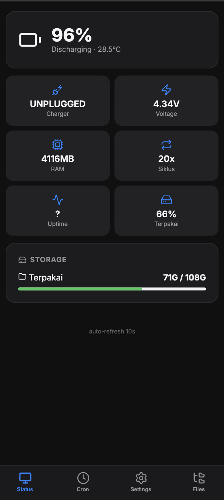
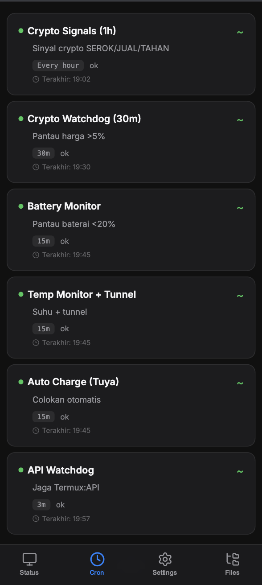
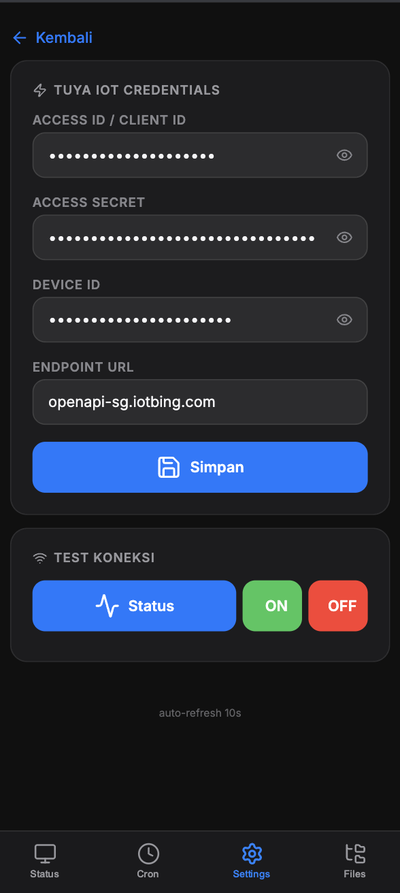
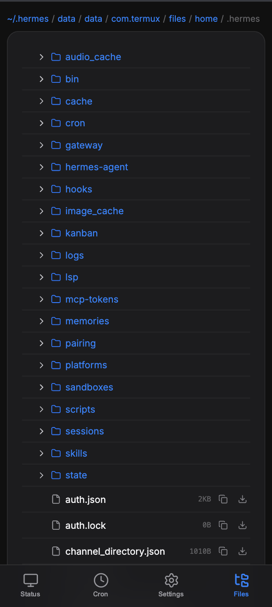

# Hermes Dashboard

Zero-dependency web dashboard for monitoring an Android Hermes Agent setup — straight from your phone.

Built entirely with **Python stdlib**. No npm, no Node, no database. `requests` is optional and only needed if you use a Tuya smart plug.

 

---

## Screenshots

| Status & Battery | Cron Jobs (Realtime) |
|:----------------:|:--------------------:|
|  |  |

| Tuya Smart Plug Control | File Browser |
|:-----------------------:|:------------:|
|  |  |

---

## Clone & Run

```bash
# 1. Clone
git clone https://github.com/sellarisstudio/agenteris.git
cd agenteris

# 2. (Optional) Install Tuya dependency — only if you use a smart plug
pip install requests

# 3. Start
python3 server.py

# 4. Open → http://localhost:5555
```

One-liner (no clone):

```bash
curl -L https://github.com/sellarisstudio/agenteris/archive/refs/heads/master.tar.gz | tar xz
cd agenteris-master && python3 server.py
```

---

## Features

| Tab | What it does |
|-----|-------------|
| **Status** | Battery %, temperature, storage, RAM, uptime |
| **Cron** | View all cron jobs with real-time countdown, read logs per job |
| **Settings** | Edit Tuya IoT credentials (Access ID, Secret, Device ID, Endpoint) + **ON/OFF** your plug from your phone |
| **Files** | Browse `~/.hermes` — view, read, download files |

---

## Public Access

**Serveo** (free, no setup):
```bash
ssh -R 80:localhost:5555 serveo.net
```
→ Get a URL like `https://xxx.serveo.net`

**Cloudflare Tunnel** (custom domain, stable):
```bash
cloudflared tunnel --url http://localhost:5555
```

---

## Dependencies

| Package | Purpose | Required? |
|---------|---------|-----------|
| Python 3.8+ | — | ✅ Yes |
| `requests` | Tuya IoT API (smart plug ON/OFF) | ❌ Optional |

Check if installed:
```bash
python3 -c "import requests; print('OK')" || pip install requests
```

---

## Tuya IoT — Getting Your API Keys

This dashboard can control Tuya-compatible smart plugs (Lavios, Smart Life, etc.).  
You need 4 credentials from [Tuya IoT Platform](https://platform.tuya.com/).

### Step-by-Step

1. **Go to** [platform.tuya.com](https://platform.tuya.com/) and log in (create an account if you don't have one).

2. **Create a project**
   - Click **Cloud** → **Projects** → **Create Cloud Project**.
   - Fill in any name (e.g. "Hermes Dashboard").
   - **Industry** → choose **Smart Home**.
   - **Development Method** → choose **Custom**.
   - **Data Center** → pick the region closest to you (e.g. **Western America** or **Singapore**).
   - Click **Create**.

3. **Get your API credentials**
   - In your new project, go to **Overview** → **Authorization Key**.
   - You'll see:
     - **Client ID** → this is your **Access ID** (`TUYA_ACCESS_ID`)
     - **Client Secret** → this is your **Access Secret** (`TUYA_ACCESS_SECRET`)
     - **API Endpoint** → note the data center URL (e.g. `openapi-sg.iotbing.com` for Singapore, `openapi-us.iotbing.com` for US)

4. **Link the app that controls your plug**
   - Under **Devices** → **Link Tuya App Account**.
   - Scan the QR code with the **Smart Life** (or Tuya) app on your phone.
   - Once linked, all your devices appear.

5. **Find your Device ID**
   - Under **Devices** → **All Devices**.
   - Find your smart plug → click it.
   - Copy the **Device ID**.

6. **Enter into the dashboard**
   - Go to **Settings → Tuya IoT** in the dashboard.
   - Fill in the 4 fields and click **Save**.
   - Click **Test Connection** to verify.

### Configuration Summary

| Field | Where to Find |
|-------|---------------|
| `TUYA_ACCESS_ID` | Cloud Project → Overview → Client ID |
| `TUYA_ACCESS_SECRET` | Cloud Project → Overview → Client Secret |
| `TUYA_DEVICE_ID` | Cloud Project → Devices → Device ID |
| `TUYA_ENDPOINT` | Your data center URL (e.g. `openapi-sg.iotbing.com`) |

> 💡 Endpoints by region:
> - Singapore: `openapi-sg.iotbing.com`
> - US West: `openapi-us.iotbing.com`
> - Europe: `openapi-eu.iotbing.com`
> - China: `openapi.tuyacn.com`

---

## Configuration

Edit `~/.hermes/.env` or use the **Settings → Tuya IoT** page in the dashboard:

| Key | Example |
|-----|---------|
| `TUYA_ACCESS_ID` | `p9xrryqc9akg4n3uu3tp` |
| `TUYA_ACCESS_SECRET` | `7d653b361e11405b8c654545584ea26a` |
| `TUYA_DEVICE_ID` | `a3671b8bebfb4d0814raom` |
| `TUYA_ENDPOINT` | `openapi-sg.iotbing.com` |

Override the Hermes path (useful for standalone setups):
```bash
HERMES_DIR=/path/to/data python3 server.py
```

---

## Project Structure

```
├── server.py              ← Entrypoint + HTTP router
├── config.py              ← Paths, port, limits
├── setup.sh               ← Init .env from example
├── handlers/
│   ├── status.py          → /api/status
│   ├── cron.py            → /api/cron, /api/log/<id>
│   ├── files.py           → /api/tree, /api/read
│   ├── settings.py        → /api/settings (GET/POST)
│   └── tuya.py            → /api/tuya-test (status + ON/OFF)
├── templates/
│   └── index.html         ← Mobile-first SPA (vanilla JS, Lucide icons)
└── utils/__init__.py      ← fmt_size()
```

---

## License

MIT — free to use, modify, sell, whatever.
